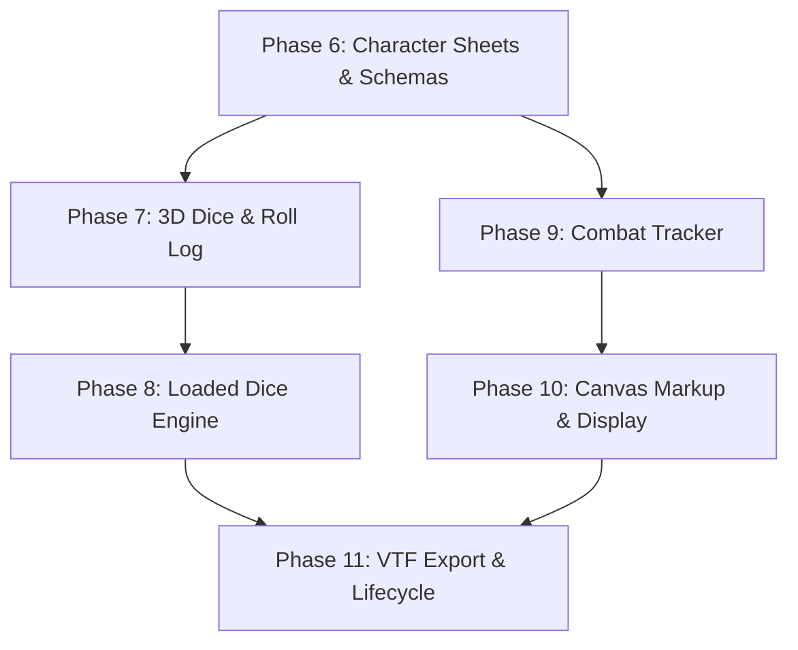

# DnD Mapper — Blazor Parity Documentation (Part 2)

This directory contains the master scope specification, architectural contracts, and individual phase implementation plans for **Part 2** of porting `KnockBox.DndMapper` to TypeScript, Phaser 4, and Lit 3.

---

## 1. Master Scope Document

- **[`blazor-parity-scope.md`](blazor-parity-scope.md)**: The comprehensive scope definition, baseline matrix, detailed subsystem scopes, wire contracts, and architectural invariants.

---

## 2. Individual Phase Implementation Plans

Each phase plan provides a complete, self-contained technical specification including legacy code anchors, domain & wire contracts, authority rules, client replica handlers, Lit UI components, scoped CSS, canvas integrations, and test acceptance criteria.

| Phase Document | Subsystems Covered | Key Deliverables |
| :--- | :--- | :--- |
| **[`phase-06-character-sheets.md`](phase-06-character-sheets.md)** | Character Sheets, Attribute Schemas, Status Effects | 15 authority verbs, effective HP calculation, markdown notes, `<dndm-character-sheet>`, token double-click navigation. |
| **[`phase-07-dice-and-roll-log.md`](phase-07-dice-and-roll-log.md)** | 3D Physics Dice, Quick Roll Footer, Roll Log | `dice-box-threejs` vendoring, 38 textures & 75 sounds, `<dndm-quick-roll-footer>`, `DiceAnimationTracker`, 50-roll capped log. |
| **[`phase-08-loaded-dice.md`](phase-08-loaded-dice.md)** | Loaded Dice Engine, DM Secret Tampering | Sandboxed `LoadedDiceProcessor`, compound conditions & modifications, DM host key streaming (30 msg/s), player indicators. |
| **[`phase-09-combat-and-initiative.md`](phase-09-combat-and-initiative.md)** | Initiative & Combat Tracker | `WaitingForRolls` -> `Active` state machine, DEX tie-breaker sorting, batch NPC rolling, active turn golden halo on map. |
| **[`phase-10-markup-and-display.md`](phase-10-markup-and-display.md)** | Freehand Canvas Markup, Projector Theater Mode | Smooth Bezier SVG drawing, cell-unit storage (1/50 scale), Space-to-pan pass-through, 100% pitch-black fog projector view. |
| **[`phase-11-vtf-export-and-lifecycle.md`](phase-11-vtf-export-and-lifecycle.md)** | Campaign Exporter (.vtf), Player Lifecycle | Browser `CompressionStream` ZIP packager, save slot export, disconnect -> NPC conversion, DM reassignment, 84-verb audit. |

---

## 3. Dependency Graph

---

## 4. Invariant Checklist for All Phases

- [ ] **512 KiB WebSocket Ceiling**: Patches must remain narrowed (e.g. `{ kind: "sheet" }`, `{ kind: "roll" }`). Never broadcast monolithic state collections.
- [ ] **30 msg/s Rate Limit**: Text inputs must debounce by 300ms; host key streaming throttled; markup drawing buffers strokes locally and commits only on `pointerup`.
- [ ] **Cell-Unit Geometry**: All persisted coordinates, dimensions, and markup paths must be in cell units (tokens at `x.5, y.5`, markup scaled by `1 / cellPixels`).
- [ ] **Authority Sandboxing**: `src/game/` code must remain pure and free of DOM, `Date`, `Math.random` (unless seeded), `setTimeout`, or Node globals.
- [ ] **Light DOM CSS Namespacing**: All ported CSS selectors must be explicitly scoped with `.dndm-*` class prefixes to prevent global style leakage.
