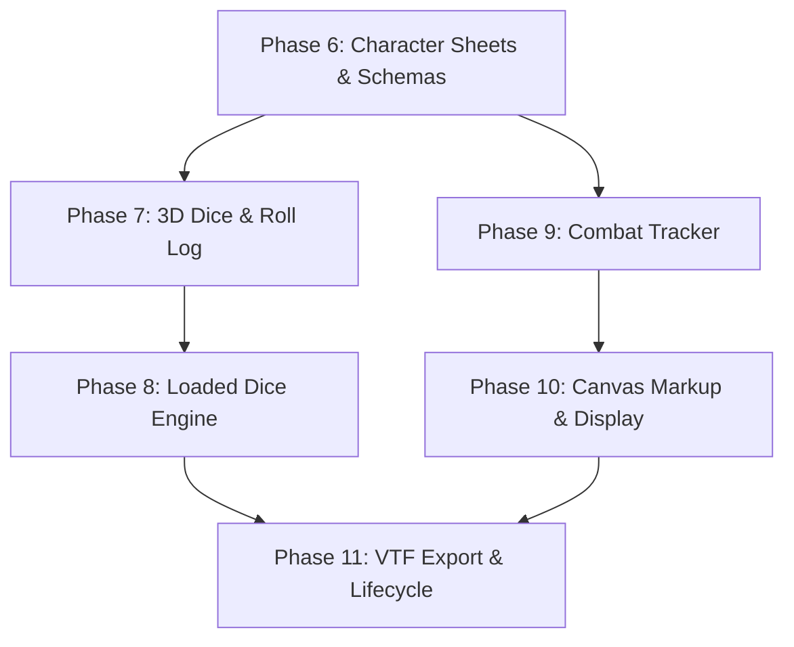

# DnD Mapper — Blazor Parity Documentation (Part 2)

This directory contains the master scope specification, architectural contracts, and individual phase implementation plans for **Part 2** of porting `KnockBox.DndMapper` to TypeScript, Phaser 4, and Lit 3.

---

## 1. Master Scope Document

- **[`blazor-parity-scope.md`](blazor-parity-scope.md)**: The comprehensive scope definition, baseline matrix, detailed subsystem scopes, wire contracts, and architectural invariants.

---

## 2. Individual Phase Implementation Plans

Each phase plan provides a complete, self-contained technical specification including legacy code anchors, domain & wire contracts, authority rules, client replica handlers, Lit UI components, scoped CSS, canvas integrations, and test acceptance criteria.

| Phase Document | Subsystems Covered | Key Deliverables |
| :--- | :--- | :--- |
| **[`phase-06-character-sheets.md`](phase-06-character-sheets.md)** | Character Sheets, Attribute Schemas, Status Effects | 15 authority verbs, effective HP calculation, markdown notes, `<dndm-character-sheet>`, token double-click navigation. |
| **[`phase-07-dice-and-roll-log.md`](phase-07-dice-and-roll-log.md)** | 3D Physics Dice, Quick Roll Footer, Roll Log | `dice-box-threejs` vendoring, 38 textures & 75 sounds, `<dndm-quick-roll-footer>`, `DiceAnimationTracker`, 50-roll capped log. |
| **[`phase-08-loaded-dice.md`](phase-08-loaded-dice.md)** | Loaded Dice Engine, DM Secret Tampering | Host-side `LoadedDiceProcessor` (runs in `applyIntent` on the DM's browser), compound conditions & modifications, DM host key streaming (throttled; per-player fan-out vs. the 30 msg/s relay limit is an open risk), player indicators. |
| **[`phase-09-combat-and-initiative.md`](phase-09-combat-and-initiative.md)** | Initiative & Combat Tracker | `WaitingForRolls` -> `Active` state machine, DEX tie-breaker sorting, batch NPC rolling, active turn golden halo on map. |
| **[`phase-10-markup-and-display.md`](phase-10-markup-and-display.md)** | Freehand Canvas Markup, Projector Popout | Smooth Bezier SVG drawing, cell-unit storage (1/50 scale), Space-to-pan pass-through, 100% pitch-black fog projector view. |
| **[`phase-11-vtf-export-and-lifecycle.md`](phase-11-vtf-export-and-lifecycle.md)** | Campaign Exporter (.vtf), Player Lifecycle | Browser `CompressionStream` ZIP packager, save slot export, disconnect -> NPC conversion, DM character reassignment (no DM succession: the lobby freezes/ends when the DM host leaves), 84-verb audit. |

---

## 3. Dependency Graph

```mermaid
graph TD
    P6["Phase 6: Character Sheets & Schemas"] --> P7["Phase 7: 3D Dice & Roll Log"]
    P6 --> P9["Phase 9: Combat Tracker"]
    P7 --> P8["Phase 8: Loaded Dice Engine"]
    P9 --> P10["Phase 10: Canvas Markup & Display"]
    P8 --> P11["Phase 11: VTF Export & Lifecycle"]
    P10 --> P11
```

---

## 4. Invariant Checklist for All Phases

- [ ] **512 KiB WebSocket Ceiling**: Under host authority the host sends each non-host player its own full `projectForPlayer` snapshot (no deltas), so the per-player snapshot is what must fit — `src/game/snapshotBudget.test.ts` guards it. Keep the narrowed `Patch` kinds (e.g. `{ kind: "sheet" }`, `{ kind: "roll" }`) anyway: today they are only an accept signal, but per-recipient deltas (KnockBox-Games#62) would ship them again.
- [ ] **30 msg/s Rate Limit**: Text inputs must debounce by 300ms; host key streaming throttled (and remember each accepted intent fans out to N−1 players — open risk, see [`../architecture-rewrite/phase-06-verification.md`](../architecture-rewrite/phase-06-verification.md)); markup drawing buffers strokes locally and commits only on `pointerup`.
- [ ] **Cell-Unit Geometry**: All persisted coordinates, dimensions, and markup paths must be in cell units (tokens at `x.5, y.5`, markup scaled by `1 / cellPixels`).
- [ ] **Pure Game Core**: There is no sandbox — the DM's browser is the host and runs the rules. `src/game/` still stays pure for testability: no DOM, no `Date` (the host passes `Date.now()` in as `now`), no `Math.random` (unless seeded), no `setTimeout`, no Node globals; log via `createLogger` (`src/log.ts`).
- [ ] **Light DOM CSS Namespacing**: All ported CSS selectors must be explicitly scoped with `.dndm-*` class prefixes to prevent global style leakage.
