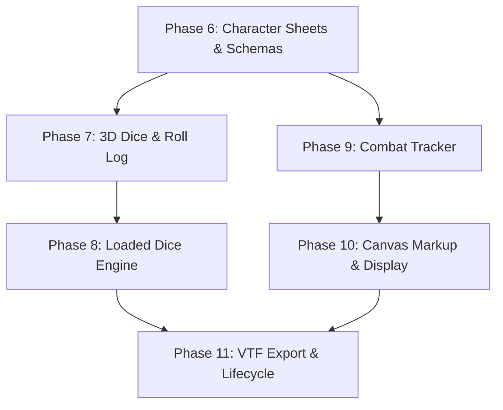

# DnD Mapper — Blazor Parity Scope (Part 2)

This document defines the complete scope, technical architecture, and implementation plan required to bring **`DnD-Mapper`** (TypeScript, Phaser 4, Lit 3) to 100% functional, visual, and behavioral parity with the legacy **`KnockBox.DndMapper`** Blazor Server plugin (~31,900 lines).

---

## 1. Executive Summary & Baseline

### The Port So Far (Part 1 Baseline)
Part 1 ([`docs/blazor-port/`](../blazor-port/README.md)) established the standalone KnockBox game and implemented the **Core Mapper (v1 / Phases 0–5 & 7–9)** with **245 passing automated tests**:
- **Rendering & Geometry**: Phaser 4 scene ([`MapScene.ts`](../../src/ui/map/MapScene.ts)) with strict cell-unit coordinates, camera midpoint correction, clamped grid rendering, 1-texel/cell fog of war bitset ([`fogLayer.ts`](../../src/ui/map/fogLayer.ts)), token layering & chip stacking ([`tokenLayer.ts`](../../src/ui/map/tokenLayer.ts)), Chebyshev ruler ([`rulerOverlay.ts`](../../src/ui/map/rulerOverlay.ts)), and focus box overlay ([`focusOverlay.ts`](../../src/ui/map/focusOverlay.ts)).
- **Asset Pipeline & Blob Share**: Image downscaler worker, WebGL2 texture size probe, `IdbBlobTransport` and `HttpBlobTransport` ([`blobTransport.ts`](../../src/assets/blobTransport.ts)), and image inspector transform handles ([`dndm-image-inspector.ts`](../../src/ui/canvas/dndm-image-inspector.ts)).
- **Persistence & VTF Import**: IndexedDB sharded auto-save with SHA-256 fingerprinting ([`libraryService.ts`](../../src/storage/libraryService.ts)), and `.vtf` ZIP import stream ([`import.ts`](../../src/vtf/import.ts)).
- **Authority & UI Shell**: Lit application shell ([`dndm-app.ts`](../../src/ui/app/dndm-app.ts)), DM/player rail gating, rail resizing/collapse with `sessionStorage` persistence, toolbar ([`dndm-toolbar.ts`](../../src/ui/canvas/dndm-toolbar.ts)), map list ([`dndm-map-list.ts`](../../src/ui/panels/dndm-map-list.ts)), layer panel ([`dndm-layer-panel.ts`](../../src/ui/panels/dndm-layer-panel.ts)), token panel ([`dndm-token-panel.ts`](../../src/ui/panels/dndm-token-panel.ts)), and saves panel ([`dndm-saves-panel.ts`](../../src/ui/panels/dndm-saves-panel.ts)).

### The Mission of Part 2
Part 1 deliberately deferred all non-mapper RPG subsystems to de-risk rendering, state synchronization, and platform asset sharing (Decision `D1` in [`00-decisions.md`](../blazor-port/00-decisions.md)). Part 2 covers everything remaining in `KnockBox.DndMapper`:
1. **Character Sheets & Attribute Schemas**
2. **3D Physics Dice Rolling, Roll Log & Roll Templates**
3. **Loaded Dice Engine & DM Secret Tampering**
4. **Initiative & Combat Tracker**
5. **Freehand Canvas Markup Overlay**
6. **Display / Projector Theater Mode**
7. **Campaign Exporter (.vtf Packager)**
8. **Player Lifecycle & Character Abandonment Reassignment**
9. **Remaining Sandboxed Authority Verbs (~40 Verbs)**
10. **Scoped CSS Migration & Light DOM Namespacing**

---

## 2. Baseline vs. Remaining Scope Matrix

| Subsystem | Legacy Implementation (`KnockBox.DndMapper`) | Current Port (`DnD-Mapper`) | Parity Status |
| :--- | :--- | :--- | :--- |
| **Grid & Viewport** | `SnapToGridHelper.cs`, `dndMapperViewport.js` | `snapping.ts`, `viewport.ts`, `MapScene.ts` | **Complete** |
| **Map Images** | `MapCanvas.razor`, `dndMapperBitmapCanvas.js`, `dndMapperImageDrag.js` | `imageLayer.ts`, `dndm-image-inspector.ts` | **Complete** |
| **Tokens & Stacking** | `TokenLayer.razor`, `TokenStackGrouper.cs`, `dndMapperTokenDrag.js` | `tokenLayer.ts`, `stacking.ts`, `dndm-token-panel.ts` | **Complete** |
| **Fog of War** | `FogPolygonBuilder.cs` (traced SVG path), `dndMapperFogPaint.js` | `fogLayer.ts` (1-texel canvas texture, brush radii 1–3) | **Complete** |
| **Ruler & Focus Box** | SVG overlays in `MapCanvas.razor`, `dndMapperFocusDrag.js` | `rulerOverlay.ts`, `focusOverlay.ts` | **Complete** |
| **Blob Sharing** | ASP.NET `/blob-share/{token}` endpoint | `IdbBlobTransport` & `HttpBlobTransport` | **Complete** |
| **Persistence & Auto-Save** | `DndMapperLibraryService.cs` (sharded IndexedDB v3) | `libraryService.ts` (sharded IndexedDB v1) | **Complete** |
| **VTF Import** | `VtfPackager.cs` (unpack), `VtfDocument.cs` | `vtf/import.ts`, `vtf/unzip.ts` | **Complete** |
| **UI Shell & Rails** | `DndMapperPlayingPhase.razor`, `dndMapperRailResize.js` | `dndm-app.ts`, `panels.css`, `shell.css` | **Complete** |
| **Character Sheets** | `CharacterSheetPanel.razor`, `AttributeSchema.cs`, `AttributeValue.cs` | Stubs in `domain.ts`, no UI or authority logic | **Pending (Phase 6)** |
| **Status Effects** | `StatusEffectsPanel.razor`, `StatusEffectTemplateLibraryModal.razor` | Stubs in `domain.ts`, no UI or authority logic | **Pending (Phase 6)** |
| **3D Dice Rolling** | `dice-box-threejs`, `DiceCanvas.razor`, `DiceAnimationTracker.cs` | Stubs in `dice.ts`, no 3D canvas, no audio/textures | **Pending (Phase 7)** |
| **Roll Log & Templates** | `QuickRollFooter.razor`, `RollLogPanel.razor`, `RollTemplate.cs` | Wire models exist in `types.ts`, no UI or log logic | **Pending (Phase 7)** |
| **Loaded Dice** | `LoadedDiceProcessor.cs`, `LoadedDiceRulesPanel.razor`, `dndMapperHostInput.js` | Domain records in `domain.ts`, no evaluation/UI | **Pending (Phase 8)** |
| **Initiative & Combat** | `HostInitiativePanel.razor`, `InitiativeBanner.razor`, `TurnOrderSorter.cs` | `CombatState` record stub, no tracker/turn logic | **Pending (Phase 9)** |
| **Canvas Markup** | `MarkupOverlay.razor`, `Map.MarkupSvg` | `markupSvg` field on `GameMap`, no drawing UI/scene | **Pending (Phase 10)** |
| **Projector View** | `DndMapperDisplay.razor` (dedicated route), `DisplayProjection.cs` | None (needs in-app theater mode / popup window) | **Pending (Phase 10)** |
| **VTF Export** | `VtfPackager.cs` (pack), `dndMapperVtfPackager.js` | None (import only) | **Pending (Phase 11)** |
| **Player Lifecycle** | `HandlePlayerLeft` -> convert to NPC, `RepresentsUserId` | Non-owner leave tolerated, but no token conversion | **Pending (Phase 11)** |

---

## 3. Subsystem Detailed Scopes

---

### Subsystem 1: Character Sheets, Attribute Schemas & Status Effects

#### 1. Legacy References
- `Services/State/Games/Data/CharacterSheet.cs`
- `Services/State/Games/Data/AttributeSchema.cs`, `AttributeRow.cs`, `AttributeValue.cs`, `AttributeDelta.cs`, `AttributeRef.cs`
- `Models/AttributePreset.cs`, `Models/AttributeValueType.cs`, `Models/SheetEditPolicy.cs`
- `Services/State/Games/Data/StatusEffect.cs`, `StatusEffectTemplate.cs`
- `Pages/Components/CharacterSheetPanel.razor` (and `.cs`, `.css` — 610 lines C#, 490 lines CSS)
- `Pages/Components/SheetSettingsModal.razor`, `SchemaPresetSelector.razor`, `SchemaCascadeWarningModal.razor`
- `Pages/Components/StatusEffectsPanel.razor`, `StatusEffectTemplateLibraryModal.razor`
- `Helpers/AttributeContributionResolver.cs`, `EffectiveMaxHpResolver.cs`, `NotesMarkdownRenderer.cs`, `SheetVisibilityHelper.cs`

#### 2. Domain & Mechanics Requirements
- **Sheet Entity**:
  ```ts
  export interface CharacterSheet {
    readonly id: string;
    readonly ownerUserId: string | null;
    readonly representsUserId: string | null; // Set when original player disconnects
    readonly characterName: string;
    readonly values: Readonly<Record<string, AttributeValue>>;
    readonly notes: string; // Markdown formatted
    readonly hp: number | null;
    readonly maxHp: number | null;
    readonly armorClass: number | null;
    readonly color: string; // Takes precedence over token color if non-empty
    readonly scopedMapId: string | null; // Filter sheets by active map
    readonly statusEffects: readonly StatusEffect[];
    readonly rollTemplates: readonly RollTemplate[];
  }
  ```
- **Attribute Value Types**:
  - `Score(value)`: Ability scores (e.g. 10..20). Standard 5e modifier calculation: `Math.floor((score - 10) / 2)`.
  - `Modifier(value)`: Direct modifier (e.g. +3).
  - `Text(value)`: Text field.
- **Attribute Presets**:
  - `DnD5eCore`: STR, DEX, CON, INT, WIS, CHA (Score).
  - `DnD5ePlusCommonSkills`: Core 6 + Athletics, Stealth, Perception, Persuasion, Investigation (Modifier).
  - `SimpleD20`: Single `Modifier` row.
  - `Custom`: Fully user-defined rows.
- **HP & Combat Calculations**:
  - `EffectiveMaxHpResolver`: Calculates effective maximum HP taking into account status effects and temporary HP adjustments.
  - HP Bar rendering with current HP, max HP, temporary HP, and unconscious / dead indicator when HP ≤ 0.
- **Notes & Markdown**:
  - Embedded Markdown notes editor with rendered preview. Replace legacy Markdig with a client-side parser (e.g. `snarkdown` or lightweight zero-dependency parser).
- **Token Linkage**:
  - When `Token.sheetId` is set, token resolves its color from `CharacterSheet.color`.
  - Double-clicking a token on the Phaser canvas triggers `openSheet(token.sheetId)` in the right rail.

#### 3. Authority Verbs to Implement
- `createSheet(characterName, scopedMapId)`
- `updateSheet(sheetId, patch)` (name, color, scopedMapId, notes)
- `deleteSheet(sheetId)`
- `duplicateSheet(sheetId)`
- `assignSheetOwner(sheetId, ownerUserId)`
- `setSheetHp(sheetId, hp)`
- `setSheetMaxHp(sheetId, maxHp)`
- `setSheetAc(sheetId, ac)`
- `updateAttributeValues(sheetId, values)`
- `setSchemaPreset(preset)`
- `updateSchemaRows(rows, initiativeAttributeName)`
- `applyStatusEffect(sheetId, effect)`
- `removeStatusEffect(sheetId, effectId)`
- `createStatusEffectTemplate(template)`
- `deleteStatusEffectTemplate(templateId)`

#### 4. UI Components (Lit)
- `<dndm-character-sheet>`: Main right-rail container. Roster list (scoped to active map or all), active sheet details, ability stats, HP tracker, AC badge, color picker.
- `<dndm-sheet-settings-modal>`: Configure sheet permissions, delete sheet, change owner.
- `<dndm-schema-preset-modal>`: Switch between 5e Core, Skills, Simple d20, and Custom.
- `<dndm-schema-cascade-warning>`: Modal warning when schema changes would orphan existing sheet attribute values.
- `<dndm-status-effects>`: Badge list on character sheet with durations, notes, and quick remove.
- `<dndm-status-effect-library-modal>`: Preset effect conditions (Blinded, Charmed, Deafened, Frightened, Grappled, Incapacitated, Invisible, Paralyzed, Petrified, Poisoned, Prone, Restrained, Stunned, Unconscious, Exhaustion, Concentrating).

---

### Subsystem 2: 3D Physics Dice Rolling, Roll Log & Roll Templates

#### 1. Legacy References
- `Pages/Components/DiceCanvas.razor` (and `.cs`, `.css` — 265 lines C#)
- `Pages/Components/QuickRollFooter.razor` (and `.cs`, `.css` — 333 lines CSS)
- `Pages/Components/RollLogPanel.razor`, `RollLogEntry.razor`
- `Pages/Components/RollHistoryModal.razor`, `RollTemplateLibraryModal.razor`
- `Helpers/DiceNotationBuilder.cs`, `DiceRollSubmitter.cs`, `DiceColorResolver.cs`
- `Services/Logic/DiceAnimationTracker.cs`, `RollLogVisibilityFilter.cs`
- `wwwroot/lib/dice-box-threejs/dice-box.es.js` (17,248 lines)
- `wwwroot/js/dndMapperDiceBox.js` (198 lines)
- 38 `.webp` textures and 75 `.mp3` sounds in `wwwroot/dice/`

#### 2. 3D Dice Simulation & Assets
- **Asset Migration**:
  - Copy the **38 `.webp` textures** (`astral`, `bronze01..04`, `dragon`, `fire`, `ice`, `marble`, `metal`, `stone`, `tiger`, `wood`, etc.) to `public/assets/dice/textures/`.
  - Copy the **75 `.mp3` sound files** (`sounds/dicehit/` 45 + `sounds/surfaces/` 30) to `public/assets/dice/sounds/`.
  - Vendor `dice-box-threejs` (Three.js + Cannon-es physics) into `src/lib/dice-box/` or as an external script bundle.
- **Overlay Canvas & Prewarming**:
  - Component `<dndm-dice-canvas>`: Transparent overlay positioned over the viewport.
  - Multi-instance management: Separate `DiceBox` instances keyed by `"user:{id}"` or `"token:{id}"` so simultaneous NPC rolls and player rolls don't clobber each other.
  - Prewarm NPC dice boxes upon entering combat to avoid Three.js initialization lag during mass rolls.
- **Animation Gating (`DiceAnimationTracker`)**:
  - When a roll intent commits, the `RollResult` is broadcast to clients, but `<dndm-roll-log>` and display views **hide the result** until the local 3D dice finish tumbling (tracked by `rollId`).
  - Interrupt handling: If a new roll arrives for the same key while one is animating, instantly settle the previous roll so results are never permanently hidden.

#### 3. Roll Controls & Templates
- **Quick Roll Footer (`<dndm-quick-roll-footer>`)**:
  - Fixed footer on the canvas area.
  - Quick buttons for standard polyhedral dice: **d4, d6, d8, d10, d12, d20, d100**.
  - Count adjuster, flat modifier input (`+3`, `-2`), and custom notation formula input (`2d6 + 1d4 + 3`).
  - Roll mode buttons: **Normal**, **Advantage** (rolls 2d20, takes higher), **Disadvantage** (rolls 2d20, takes lower).
  - Hotkey modifiers: Holding `Shift` clicks with Advantage; holding `Ctrl` clicks with Disadvantage.
- **Roll Templates**:
  - Built-in templates: d4, d6, d8, d10, d12, d20, d100, 2d6, 4d6 (deterministic GUIDs `d0000000-...-0000000101..109`).
  - Global templates authored by the DM (e.g. standard attacks, spell saves).
  - Sheet-scoped templates (character-specific weapons, spells, skill checks with linked attribute modifiers like `DEX`).
  - Modal `<dndm-roll-template-library>`: Author, edit, delete templates.

#### 4. Roll Log & History
- **Replicated Roll Log**:
  - Replicated in match state with a **cap of 50 rolls** (`RollLogCap = 50`).
  - Each `RollResult` stores: roller ID, timestamp, formula string, modifier breakdown, individual die results, total, mode (Normal/Advantage/Disadvantage), natural 20 / natural 1 flags, applied loaded-dice rules, and linked token ID.
- **Visibility Filtering**:
  - `rollsVisibleToPlayers` session setting: when false, players only see their own rolls.
  - DM can toggle secret rolls.
- **Modal `<dndm-roll-history>`**: Searchable, filterable modal viewing all rolls from the session.

---

### Subsystem 3: Loaded Dice Engine & DM Secret Tampering

#### 1. Legacy References
- `Services/Logic/LoadedDice/LoadedDiceProcessor.cs` (91 lines)
- `Services/State/Games/Data/LoadedDice/LoadedDiceRule.cs`, `LoadedDiceCondition.cs`, `LoadedDiceModification.cs`, `LoadedDiceContext.cs`, `LoadedDiceRuleStamp.cs`
- `Models/LoadedDiceRuleVisibility.cs`, `Models/LoadedDicePlayerIndicator.cs`
- `Pages/Components/LoadedDice/LoadedDiceRulesPanel.razor` (and `.cs`, `.css`)
- `wwwroot/js/dndMapperHostInput.js` (138 lines)

#### 2. Sandboxed Rule Processor
- **Execution Hook**:
  - Evaluates rules purely inside the authority sandbox on every roll before committing the `RollResult`.
- **Target Filtering**:
  - Target character sheet IDs, or unattributed "GM" rolls (`Guid.Empty`), or all rolls.
- **Conditions**:
  - `currentMap`: Matches active map ID.
  - `diceTypeRolled`: Sides match (e.g. 20).
  - `rollerIs`: Specific player ID or DM.
  - `rollModeIs`: Normal, Advantage, Disadvantage.
  - `combatActive`: Active combat in progress.
  - `rollLabelContains`: Substring match on roll label/name.
  - `hostKeyHeld`: DM holds a specific key on their keyboard (e.g. Space, 1, H) when the roll occurs.
  - Compound conditions: `allOf`, `anyOf`, `not`.
- **Modifications**:
  - `setResult`: Force die face to value (clamped to `[1, sides]`).
  - `clampMax`: Cap maximum face.
  - `clampMin`: Floor minimum face.
  - `biasLower`: Roll twice, take lower (or subtract bias).
  - `biasHigher`: Roll twice, take higher (or add bias).
  - `rerollOn`: Reroll if face equals target.
- **Auditing & Stamping**:
  - Matched rule IDs and names are stamped on `RollResult.appliedRules`.
  - `LoadedDiceRuleVisibility`: `Hidden` (players never see stamps), `VisibleToHostOnly`, or `VisibleToAll`.
  - `LoadedDicePlayerIndicator`: Visual cue on player screen (`None`, `Subtle`, `Obvious`).

#### 3. Host Key Streaming (`dndMapperHostInput.js` Port)
- Track keys currently held by the DM using `keydown`/`keyup`/`blur` listeners on the host browser.
- Normalize key names (e.g. `" "` -> `"Space"`).
- Debounce and send `updateHostKeys` intents to the authority without exceeding the 30 msg/s rate limit.

#### 4. UI Components
- `<dndm-loaded-dice-panel>`:
  - In DM left rail (when `LoadedDiceEnabled` is true in settings): Rule list, enable/disable toggles, rule builder (conditions, modifications, targets).
  - In player right rail: Read-only rule list when `LoadedDiceRuleVisibility` is set to `VisibleToAll`.

---

### Subsystem 4: Initiative & Combat Tracker

#### 1. Legacy References
- `Pages/Components/HostInitiativePanel.razor` (and `.cs`, `.css` — 228 lines CSS)
- `Pages/Components/InitiativeBanner.razor` (and `.cs`, `.css`)
- `Services/State/Games/Data/CombatState.cs`, `CombatantEntry.cs`
- `Helpers/TurnOrderSorter.cs`, `InitiativeAnimationGate.cs`
- `DndMapperGameEngine.cs:1469-2093` (11 combat verbs)

#### 2. Combat State Machine & Rules
- **State Structure**:
  ```ts
  export type CombatPhase = "WaitingForRolls" | "Active";

  export interface CombatantEntry {
    readonly id: string;
    readonly tokenId: string;
    readonly name: string;
    readonly ownerUserId: string | null;
    readonly initiativeRoll: number | null;
    readonly isForceRolled: boolean;
    readonly pendingInitiative: number | null; // DM manual override holding buffer
  }

  export interface CombatState {
    readonly phase: CombatPhase;
    readonly roundNumber: number;
    readonly currentTurnIndex: number;
    readonly turnOrder: readonly CombatantEntry[];
  }
  ```
- **Lifecycle & Turn Order**:
  - `startCombat`: Pulls all tokens from the active map into `turnOrder`. Phase becomes `WaitingForRolls`.
  - Rolling Initiative:
    - Players roll initiative via character sheet (using linked `initiativeAttributeName`, default DEX) or flat d20.
    - DM can click **"Roll all unset NPCs"** to batch-roll for all NPC tokens.
    - DM manual entry: `setNpcInitiative` sets `pendingInitiative` so manual scores can be staged without spoiling dice rolls.
  - Sorting:
    - Sorted descending by initiative score. Tie-breaking by character sheet DEX modifier, then roll timestamp.
  - Combat Execution:
    - Once all combatants have rolls (or DM forces start), phase transitions to `Active`.
    - **Next Turn (`>`)**: Advances `currentTurnIndex`. When reaching end of list, increments `roundNumber` and resets index to 0.
    - **Previous Turn (`<`)**: Reverses turn index; decrements `roundNumber` if wrapping backwards.
    - **End Combat**: Resets `CombatState` to null.

#### 3. Map Canvas Integration
- **Active Turn Halo**:
  - The token whose turn is active displays an animated golden glow / selection ring on the Phaser map scene (`ResolveActiveTurnTokenId`).

#### 4. UI Components
- `<dndm-host-initiative>`: DM right-rail panel. Round counter, current turn indicator, next/previous buttons, list of combatants showing HP/MaxHP/AC, status effect chips, roll initiative button, and remove/add combatant controls.
- `<dndm-initiative-banner>`: Compact banner shown to players in the right rail or over canvas. In `WaitingForRolls`, displays "Roll Initiative!" button; in `Active`, highlights current combatant ("Your Turn!" or "Grog's Turn").

---

### Subsystem 5: Freehand Canvas Markup Overlay

#### 1. Legacy References
- `Pages/Components/MarkupOverlay.razor` (and `.cs`, `.css`)
- `MapCanvas.razor:35-42`, `MapCanvas.razor.cs:780-840`
- `Map.MarkupSvg`
- `DndMapperGameEngine.cs:2094-2120` (`UpdateMapMarkupAsync`)

#### 2. Interactive Drawing Surface
- **Overlay Layer**:
  - Interactive SVG/HTML5 canvas drawing overlay positioned over the Phaser map.
  - Toolbar button in `<dndm-toolbar>`: `✎ markup` (DM only).
- **Drawing Tools**:
  - Pen tool: Freehand smoothed SVG paths (Bezier curve fitting).
  - Eraser tool: Erase individual strokes.
  - Color palette: Copper, crimson, emerald, gold, white, black.
  - Stroke thickness presets: 1px, 2px, 4px, 8px.
  - Clear all markup button with confirmation.
  - Local Undo / Redo stack during active drawing session.
- **Coordinate Transformation**:
  - Drawing takes place in CSS pixel coordinates (`viewBox="0 0 W*CellPx H*CellPx"`).
  - On commit, paths are scaled by `1 / CellPixels` so the persisted string is stored in cell units in `GameMap.markupSvg`.
  - This ensures markup scales crisply across all zoom levels (`0.01` to `10.0`) and stays aligned with map coordinates.
- **Interaction Rules**:
  - Holding `Space` temporarily forces pointer-events to pass through, allowing the DM to pan the map while the markup tool is active.

---

### Subsystem 6: Display / Projector Theater Mode

#### 1. Legacy References
- `Pages/DndMapperDisplay.razor` (and `.cs`, `.css` — 513 lines CSS)
- `Helpers/DisplayProjection.cs` (92 lines)
- `wwwroot/js/dndMapperDisplayTokens.js` (121 lines)
- `wwwroot/js/dndMapperDisplayImageFallback.js` (42 lines)

#### 2. Platform Architecture Adaptation
- In legacy, this was a second URL route (`/room/dnd-mapper/{code}/display`).
- In KnockBox-Games, games run as single-entry-point bundles in an iframe.
- **Solution**: Port the display view as an **in-app Theater Mode** (fullscreen button) or **Detached Popup Window** (`window.open('', '_blank')` sharing client state via `BroadcastChannel` or second client instance).

#### 3. Display Projection Rules
- Uses `DisplayProjection`:
  - **Fog of War**: Renders at **1.0 opacity (100% pitch black)**. Unexplored areas are completely dark.
  - **Hidden Entities**: Tokens with `hidden: true` and images with `hidden: true` are completely excluded from rendering.
  - **Fog Culling**: Tokens standing on fogged cells are not rendered. Images completely shrouded in fog are culled.
  - **Focus Rect Framing**: If the DM has set a `FocusRect` (via the focus box tool), the display viewport automatically frames to that rectangle. If null, it fits the active map bounds.
  - **Token Animations**: Uses smooth 250ms ease-out transitions for token movement instead of instant snap.
  - **Active Combatant Indicator**: Golden ring/glow on the active combatant's token during combat.
  - **Roll Result Ticker**: Bottom-right floating ticker displaying the last 10 rolls (filtered by visibility, delayed until 3D dice settle).

---

### Subsystem 7: Campaign Exporter (.vtf Packager)

#### 1. Legacy References
- `Services/Library/Vtf/VtfPackager.cs` (599 lines)
- `Services/Library/Vtf/VtfDocument.cs`
- `wwwroot/js/dndMapperVtfPackager.js` (282 lines)

#### 2. Packaging Specification
- Generates a valid Virtual Table Format v1.0.0 ZIP archive:
  - `manifest.json`: Spec version 1.0.0, campaign metadata.
  - `global_state.json`: Custom templates, global roll templates, settings, attribute schema.
  - `scenes/scene_{mapId}.json`: Grid config, fog bitset, token instances, image layer order.
  - `entities/entity_{tokenId}.json` & `entities/sheet_{sheetId}.json`: Token and sheet definitions.
  - `assets/images/{imageId}.[png|jpg|webp]`: Raw image blobs extracted from IndexedDB.
  - `extensions/knockbox_dnd_mapper.json`: Active combat state, phase, loaded dice rules.
- Pure browser ZIP creation using `CompressionStream('deflate-raw')`, local headers, central directory, and EOCD (porting `dndMapperVtfPackager.js`).
- Triggers browser file download: `{CampaignName}_{yyyyMMdd_HHmm}.vtf`.
- **UI**: Add an "Export" button to each slot row in `<dndm-saves-panel>`.

---

### Subsystem 8: Player Lifecycle & Abandonment Reassignment

#### 1. Legacy References
- `DndMapperGameEngine.cs:88-95` (`HandlePlayerLeft`)
- `DndMapperGameEngine.cs:3547-3600` (`ConvertAbandonedPlayerCharacterInternal`, `SpawnPlayerTokenInternal`)

#### 2. Lifecycle Behaviors
- **Session Start**:
  - Automatically spawn player tokens at `defaultSpawnPosition` (or map center) for all players present in the lobby.
- **Player Disconnect / Leave**:
  - When a non-DM player disconnects:
    - Their token is converted from `PlayerToken` to `NPCToken` so it remains on the board.
    - Set `Token.representsUserId` and `CharacterSheet.representsUserId` to the disconnected player's ID.
    - Display "(originally played by ...)" subtitle in the token and sheet UI.
- **DM Reassignment**:
  - Provide a "Reassign Character" action in `<dndm-token-panel>` and `<dndm-character-sheet>` allowing the DM to assign the abandoned token and sheet to any connected player.

---

### Subsystem 9: Sandboxed Authority Verbs (~40 Verbs)

#### 1. Legacy References
- `Services/Logic/Games/DndMapperGameEngine.cs` (~84 total verbs, 3,703 lines)

#### 2. Verbs to Port into `src/game/rules.ts`

```
Category            Verb / Intent                   Description
────────────────────────────────────────────────────────────────────────────────────────────────────
Sheets              createSheet                     Create character sheet
                    updateSheet                     Update name, color, notes, scopedMapId
                    deleteSheet                     Delete character sheet
                    duplicateSheet                  Clone existing sheet
                    assignSheetOwner                Set ownerUserId or clear to null
                    setSheetHp                      Set current HP
                    setSheetMaxHp                   Set maximum HP
                    setSheetAc                      Set armor class
                    updateAttributeValues           Update map of attribute scores/modifiers
Attributes          setSchemaPreset                 Switch preset (5e Core, Skills, d20, Custom)
                    updateSchemaRows                Add/edit/remove custom attribute rows
                    setInitiativeAttribute          Choose attribute used for initiative
Status Effects      applyStatusEffect               Add effect instance to sheet
                    removeStatusEffect              Remove effect instance from sheet
                    createEffectTemplate            Add reusable global effect template
                    deleteEffectTemplate            Remove reusable global effect template
Dice & Rolls        rollDice                        Execute standard dice roll with modifiers
                    rollTemplate                    Roll using a defined RollTemplate
                    clearRollLog                    Clear roll log (DM only)
Loaded Dice         createLoadedDiceRule            Create new loaded dice rule
                    updateLoadedDiceRule            Edit conditions/modifications/targets
                    deleteLoadedDiceRule            Delete loaded dice rule
                    toggleLoadedDiceRule            Enable / disable rule
                    reorderLoadedDiceRules          Change rule priority order
                    updateHostKeys                  Stream DM held keys for condition match
Combat Tracker      startCombat                     Enter WaitingForRolls, populate combatants
                    endCombat                       Clear active combat
                    nextTurn                        Advance turn pointer and round count
                    previousTurn                    Step backwards in turn order
                    rollInitiative                  Roll initiative for player combatant
                    setNpcInitiative                Stage pending manual NPC initiative
                    rollAllUnsetNpcs                Batch roll for all unrolled NPCs
                    addCombatant                    Add ad-hoc combatant to active combat
                    removeCombatant                 Drop combatant from active combat
Markup              updateMarkup                    Commit new or cleared SVG markup to map
Lifecycle           endSession                      Return match to lobby phase
```

#### 3. Wire Contract & 512 KiB Frame Protection
- Authority patches must remain **narrowed**:
  - `{ kind: "sheet", sheet: CharacterSheet }` (single sheet)
  - `{ kind: "sheetRemoved", sheetId: string }`
  - `{ kind: "roll", roll: RollResult }` (single roll result appended)
  - `{ kind: "combat", combat: CombatState | null }`
  - `{ kind: "markup", mapId: string, markupSvg: string | null }`
  - `{ kind: "loadedDiceRules", rules: readonly LoadedDiceRule[] }`
- **Rate Limit Defense**:
  - Debounce text input in character sheets (`300 ms`) before emitting intents.
  - Never emit intents on pointer-move (accumulate freehand markup strokes and commit on `pointerup`).

---

### Subsystem 10: Scoped CSS & Lit UI Migration

#### 1. Legacy References
- 34 `.razor.css` files (~4,658 lines)
- `wwwroot/css/panels.css` (634 lines — already ported to `src/ui/styles/panels.css`)

#### 2. CSS Re-namespacing Plan
Because `GameElement` renders into light DOM for global CSS access, all Blazor-scoped CSS must be stripped of `[b-xxxxxxxxxx]` attributes and given explicit `.dndm-*` namespace prefixes:

| Legacy Scoped File | Target CSS File | New Root Selector |
| :--- | :--- | :--- |
| `CharacterSheetPanel.razor.css` (490 lines) | `src/ui/styles/sheet.css` | `.dndm-sheet-panel` |
| `HostInitiativePanel.razor.css` (228 lines) | `src/ui/styles/initiative.css` | `.dndm-initiative-panel` |
| `InitiativeBanner.razor.css` | `src/ui/styles/initiative.css` | `.dndm-initiative-banner` |
| `QuickRollFooter.razor.css` (333 lines) | `src/ui/styles/dice.css` | `.dndm-quick-roll` |
| `DiceCanvas.razor.css` | `src/ui/styles/dice.css` | `.dndm-dice-canvas` |
| `RollLogPanel.razor.css` & `RollLogEntry.razor.css` | `src/ui/styles/dice.css` | `.dndm-roll-log` |
| `LoadedDiceRulesPanel.razor.css` | `src/ui/styles/loaded-dice.css` | `.dndm-loaded-dice` |
| `StatusEffectsPanel.razor.css` (216 lines) | `src/ui/styles/status-effects.css` | `.dndm-status-effects` |
| `MarkupOverlay.razor.css` | `src/ui/styles/markup.css` | `.dndm-markup-overlay` |
| `DndMapperDisplay.razor.css` (513 lines) | `src/ui/styles/display.css` | `.dndm-display-view` |

---

## 4. Phased Roadmap (Phases 6 – 11)



### Phase 6: Character Sheets, Attribute Schemas, & Status Effects
1. Authority types & rules: `CharacterSheet`, `AttributeSchema`, score-to-modifier formulas, effective HP calculation.
2. Authority intents, narrowed patches (`{ kind: "sheet" }`, `{ kind: "schema" }`), and tests.
3. Lit components: `<dndm-character-sheet>`, notes markdown renderer, `<dndm-sheet-settings-modal>`, `<dndm-schema-preset-modal>`, `<dndm-schema-cascade-warning>`.
4. Status effects: `<dndm-status-effects>`, template library modal.
5. Canvas hook: Token double-click opens linked character sheet.

### Phase 7: 3D Physics Dice, Quick Roll Footer, & Roll Log
1. Vendor `dice-box-threejs` with Three.js and Cannon-es; stage 38 textures and 75 sounds.
2. Authority dice rolling engine: formula parsing (`2d6 + 3`), advantage/disadvantage, deterministic roll resolution.
3. `<dndm-dice-canvas>`: Overlay, multi-box management, prewarming.
4. `DiceAnimationTracker`: Gating roll-log reveal until dice finish tumbling.
5. UI: `<dndm-quick-roll-footer>`, `<dndm-roll-log>`, `<dndm-roll-templates-modal>`, `<dndm-roll-history-modal>`.

### Phase 8: Loaded Dice Engine & DM Secret Tampering
1. Sandboxed `LoadedDiceProcessor`: pure condition evaluator and modification applier.
2. Authority integration: intercept rolls, apply matched rules, stamp `appliedRules`.
3. Host key streaming: `keydown`/`keyup` tracking on DM client, debounced intent updates.
4. UI: `<dndm-loaded-dice-panel>` in DM left rail, player indicator indicators (`LoadedDicePlayerIndicator`).

### Phase 9: Initiative & Combat Tracker
1. Combat state machine: `WaitingForRolls` -> `Active`, round counting, turn index tracking.
2. Turn order sorting: Descending initiative, DEX modifier tie-breaking.
3. Staggered batch NPC rolling & manual `PendingInitiative` staging.
4. UI: `<dndm-host-initiative>` in DM rail, `<dndm-initiative-banner>` for players.
5. Canvas integration: Active turn token highlight halo in Phaser scene.

### Phase 10: Freehand Canvas Markup Overlay & Projector Mode
1. Interactive SVG drawing layer on Phaser stage, pen/eraser/color/width tools, undo/redo, clear all.
2. Pixel-to-cell transformation and storage in `GameMap.markupSvg`.
3. Spacebar bypass for panning.
4. Display theater mode: In-app fullscreen / detached window with 100% fog opacity, focus rect auto-framing, 250ms token animations, roll ticker.

### Phase 11: Campaign Exporter (.vtf Packager) & Final Parity Polish
1. Client-side `.vtf` ZIP packager (`CompressionStream('deflate-raw')`) packaging manifest, scenes, entities, images, and extensions.
2. "Export" button on save slots in `<dndm-saves-panel>`.
3. Disconnect handling: Player token -> NPC token conversion, `RepresentsUserId` preservation, and DM reassignment UI.
4. End-to-end parity audit against legacy Blazor app.

---

## 5. Architectural Invariants & Risk Register

| Risk / Invariant | Impact | Mitigation Strategy |
| :--- | :--- | :--- |
| **512 KiB WebSocket Frame Ceiling** | Broadcast dropped silently or 1009 socket kill | Always use narrowed patches (`kind: "sheet"`, `kind: "roll"`). Never broadcast full sheets dictionary. |
| **Intent Rate Limits (30 msg/s, 60 burst)** | 1008 terminal socket close | Debounce sheet text inputs (`300 ms`). Never send network intents on pointer-move during markup. |
| **Cell-Unit vs. Pixel Coordinates** | Silent half-cell alignment drift | Persist all geometry (tokens, images, fog, markup) in cell units. Scale markup by `1 / CellPixels` on commit. |
| **Three.js Main-Thread Jitter** | Rolling 10 NPC dice freezes frame rate | Prewarm dice boxes upon entering combat; stagger roll triggers across animation frames. |
| **Authority Sandbox Restrictions** | Server runtime error | No DOM, no timers, no `Date` object in `src/game/` (use `kb.now()`). Pure deterministic functions only. |
| **Light DOM CSS Collisions** | Unintended global styling bleed | Prefix all ported CSS rules with `.dndm-*` component namespaces. |
| **Spoilers Before Dice Settle** | Results visible in log while dice roll | Use `DiceAnimationTracker` to hide roll log entry until 3D dice finish tumbling. |
